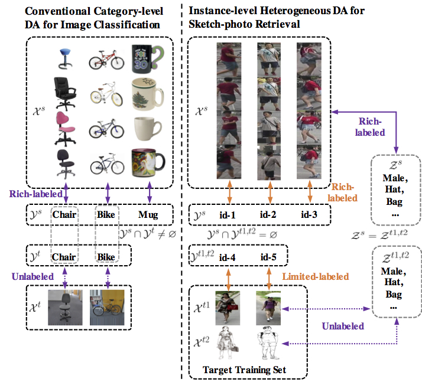

# Instance-level Heterogeneous Domain Adaptation for Limited-labeled Sketch-to-Photo Retrieval

<!-- TABLE OF CONTENTS -->
## Table of Contents

* [About the Project](#about-the-project)
* [Dataset Download Link](#dataset-download-link)
* [Getting Started](#getting-started)
  * [Installation](#installation)
  * [Run code](#run-code)
* [Demos](#demos)
* [License](#license)
* [Acknowledgements](#acknowledgements)

## About the Project
Although sketch-to-photo retrieval has a wide range of applications, it is costly to obtain paired and rich-labeled ground truth. Differently, photo retrieval data is easier to acquire. Therefore, previous works pre-train their models on rich-labeled photo retrieval data (i.e., source domain) and then fine-tune them on the limited-labeled sketch-to-photo retrieval data (i.e., target domain). However, without co-training source and target data, source domain knowledge might be forgotten during the fine-tuning process, while simply co-training them may cause negative transfer due to domain gaps. Moreover, identity label spaces of source data and target data are generally disjoint and therefore conventional category-level Domain Adaptation (DA) is not directly applicable. To address these issues, we propose an Instance-level Heterogeneous Domain Adaptation (IHDA) framework. We apply the fine-tuning strategy for identity label learning, aiming to transfer the instance-level knowledge in an inductive transfer manner. Meanwhile, labeled attributes from the source data are selected to form a shared label space for source and target domains. Guided by shared attributes, DA is utilized to bridge cross-dataset domain gaps and heterogeneous domain gaps, which transfers instance-level knowledge in a transductive transfer manner. Experiments show that our method has set a new state of the art on three sketch-to-photo image retrieval benchmarks without extra annotations, which opens the door to train more effective models on limited-labeled heterogeneous image retrieval tasks.



## Dataset Download Link:
  [zap.t](https://drive.google.com/file/d/1a0-lCtSdge8G1H7ST_gb94FDbxLYSNdh/view?usp=sharing)
  [market.t](https://drive.google.com/file/d/19PXvFFdhffJeog2h_3eBe7oqRNH1vv0c/view?usp=sharing)
  [pku_best_96.t](https://drive.google.com/file/d/1dAm18J9EKI4HnbuwAsm79iLaO1xjhux0/view?usp=sharing)
  [sbir_best_69.t](https://drive.google.com/file/d/1tY085_l-8c4ufjZrHKeKtBkAzNAdApLe/view?usp=sharing)
  

## Getting Started
### Installation
The code was tested on Ubuntu 18.04, with Anaconda Python 3.6 and PyTorch v1.1.0.

You may need to install requirements.txt by
```sh
pip3 install requirements.txt
```
### Run code
1. Download data and put them to /data folder
2. Download [model weight](https://drive.google.com/open?id=1AGo6qc1xOiC-DnY0K1Xx824uB9F3Mwzp) and put it to /reid folder
3. Run pano_detector.ipynb to generate and save 2D detection boxes.
4. Run tracking.ipynb to generate and save tracking links (we will update the tracker from DeepSort to ours later).
5. Run generate_video.ipynb to generate visulation videos.

## Demos:


<!-- LICENSE -->
## License
The code is distributed under the MIT License. See `LICENSE` for more information.

## Citation
```
@inproceedings{yang2020mplt,
  title={Using panoramic videos for multi-person localization and tracking in a 3D panoramic coordinate},
  author={Fan Yang, Feiran Li, Yang Wu, Sakriani Sakti, and Satoshi Nakamura},
  booktitle={International Conference on Acoustics, Speech, and Signal Processing},
  year={2020}
}
```

<!-- ACKNOWLEDGEMENTS -->
## Acknowledgements (parts of our code are borrowed from)
* [Tiny Person re-id](https://github.com/lulujianjie/person-reid-tiny-baseline)
* [Cross-Modal-Re-ID-baseline](https://github.com/mangye16/Cross-Modal-Re-ID-baseline)
